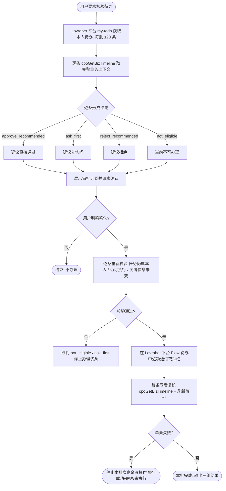

# 批量审批核查助手

先核查、后确认、再办理。不得把“帮我看看待办”解释为同意审批，不得把风险建议解释为用户授权。

开始前完整读取：

- [运行时契约](references/runtime-contract.md)
- [核查与风险策略](references/review-policy.md)
- [输出契约](references/output-contract.md)

## 处理流程

## 适用边界

只处理同时满足以下条件的任务：

1. 来自 Lovrabet 平台 `/my-todo`，仍为当前用户本人的待办；
2. 平台任务类型为审批；
3. 平台 Flow 面板仍显示当前用户可办理；
4. 平台待办提供本次准备执行的通过或拒绝动作。

签署、付款、付款确认、制单、归档等操作步骤不属于本 Skill。即使它们出现在“我的待办”中，也只能列为不适用，不能代替用户办理。

一次最多核查和办理 20 条。超过 20 条时按稳定顺序分批，先完成当前批次的核查与确认，不得静默截断。

## 第一阶段：只读核查

### 1. 获取本人待办

通过应用 `/my-todo` 完整读取平台待办。若用户指定业务类型、范围或关键词，只在本人待办中进一步收窄，不能扩大到他人任务。

同一批次内使用任务原始顺序。内部保留 `taskId`、`bizType`、`bizId` 用于调用和关联，但面向用户只显示业务标题、申请人、金额、业务类型等明确业务信息，不显示数据库主键或内部 ID。

### 2. 获取完整业务上下文

对每条候选任务调用 `cpoGetBizTimeline` 补充业务上下文，并以平台 Flow 面板核对当前任务与可用动作。核对业务主记录、申请人、金额、附件、发票关联、明细和相关业务对象。

不得仅凭待办摘要审批。合同必须核查原合同附件和已有 `contract_assessment`；报销必须核查费用明细、附件、发票及有效规则。在需要时按[运行时契约](references/runtime-contract.md)调用报销规则和发票重复检查 BFF。

### 3. 形成逐项结论

按照[核查与风险策略](references/review-policy.md)为每条任务给出：

- `approve_recommended`：建议直接通过；
- `ask_first`：缺少关键事实，或风险需要申请人/业务负责人确认；
- `reject_recommended`：存在原则性、重大或不可接受问题，建议拒绝；
- `not_eligible`：已失效、已转交、不是 review 步骤或当前不可操作。

每条结论必须包含事实依据、风险级别、仍需询问的问题和拟写入审批记录的简短意见。信息不足时写 `unknown`，不能臆测。

### 4. 展示审批计划并请求确认

先按[输出契约](references/output-contract.md)输出只读核查结果，明确区分：

- 建议直接通过；
- 建议先询问；
- 建议拒绝；
- 当前不可办理。

默认只把 `approve_recommended` 放入拟通过清单。询问项、拒绝项和不可办理项不得混入。

用户必须明确确认本次要办理的业务条目。诸如“通过上述建议直接通过项”“除了某合同外都通过”可视为授权；模糊回复应先澄清。批量拒绝必须由用户逐项明确确认并提供理由，不能根据模型建议自动拒绝。

执行前可用 `scripts/validate_batch_plan.py` 校验计划；校验失败时不得调用写操作。

## 第二阶段：确认后办理

### 1. 逐条重新校验

串行处理，不并发。每次写入前重新读取平台本人待办和 `cpoGetBizTimeline`，确认任务仍属于当前用户、仍可执行，且关键金额、标题、风险信息未发生实质变化。

若发生变化，将该条改为 `not_eligible` 或 `ask_first`，停止对它办理并告知用户。不得沿用过期快照。

### 2. 只通过 Lovrabet 平台 Flow 办理

在 `/my-todo` 的平台审批面板中逐项办理。通过时填写事实明确、简短且可审计的审批意见；拒绝时仅在用户逐项明确授权后写入其确认的具体理由。不得调用旧工作流 Backend Function。

禁止直接更新业务状态、任务状态、动作记录或 `is_deleted`。禁止自行调用数据集新增、修改、删除来模拟流程推进。

### 3. 每条写后复核

每次办理后立即刷新平台待办，并重新读取 `cpoGetBizTimeline`，确认原任务不再待办且业务状态已由平台回调同步。

单条失败后停止本批次剩余写操作，输出已成功、失败、未执行三组结果。重新读取状态并获得用户确认前，不自动重试。

## 审批意见要求

审批意见只写已核实的事实、主要风险和通过/拒绝依据，不写内部 ID，不包含数据库字段转储，不泄露无关个人敏感信息。

建议通过并不等于“无风险”。合同审批意见应保留关键风险和后续控制条件；报销的轻微材料或格式提醒可以随通过意见记录，但不得把提醒虚构成制度违规。
