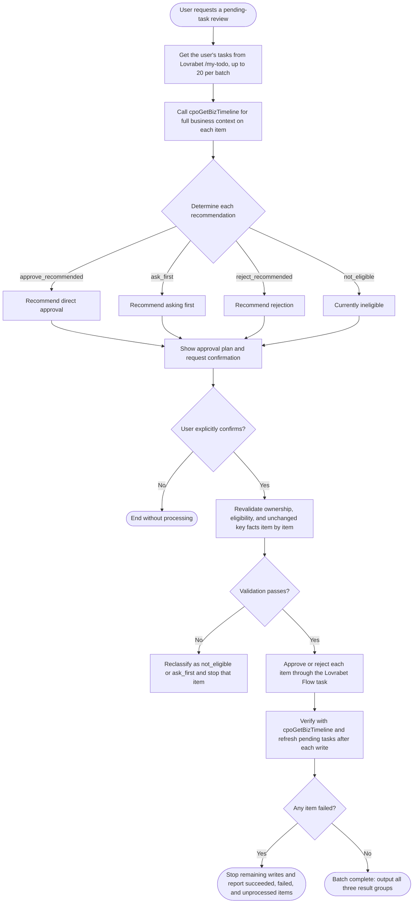

# Batch Approval Review Assistant

Review first, obtain confirmation second, and process last. Never interpret “take a look at my pending tasks” as approval authorization, and never treat a risk recommendation as user authorization.

Read these files in full before starting:

- [Runtime Contract](references/runtime-contract.md)
- [Review and Risk Policy](references/review-policy.md)
- [Output Contract](references/output-contract.md)

## Workflow

## Scope

Process only tasks that meet all of these conditions:

1. The task comes from Lovrabet `/my-todo` and is still assigned to the current user.
2. The platform task type is approval.
3. The platform Flow panel still shows that the current user can process it.
4. The pending task exposes the approve or reject action to be performed.

Signing, payment execution, payment confirmation, voucher preparation, archiving, and similar operation steps are outside this Skill. Even when they appear in “My Pending Tasks,” list them as ineligible and do not process them for the user.

Review and process no more than 20 tasks at a time. For more than 20 tasks, use stable ordering and batches. Finish reviewing and confirming the current batch without silently truncating the list.

## Phase 1: Read-only Review

### 1. Get the Current User's Pending Tasks

Read all platform tasks from the application `/my-todo` page. If the user specifies a business type, range, or keyword, narrow the current user's tasks only; never expand the scope to another user's tasks.

Preserve the source order within the batch. Keep `taskId`, `bizType`, and `bizId` internally for calls and correlation. In user-facing output, show clear business information such as the title, applicant, amount, and business type; do not expose database primary keys or internal IDs.

### 2. Get Complete Business Context

Call `cpoGetBizTimeline` for each candidate and use the platform Flow panel to confirm the current task and available actions. Check the primary business record, applicant, amount, attachments, invoice links, line items, and related business objects.

Never approve from the pending-task summary alone. For contracts, inspect the original contract attachment and any existing `contract_assessment`. For expenses, inspect expense lines, attachments, invoices, and effective rules. When necessary, call the expense-rule and invoice-duplicate-check BFFs described in the [Runtime Contract](references/runtime-contract.md).

### 3. Determine Each Recommendation

Following the [Review and Risk Policy](references/review-policy.md), assign every task one of:

- `approve_recommended`: direct approval is recommended.
- `ask_first`: key facts are missing, or a risk requires confirmation from the applicant or business owner.
- `reject_recommended`: a fundamental, material, or unacceptable issue warrants rejection.
- `not_eligible`: the task is stale, reassigned, not a review step, or currently unavailable.

Every recommendation must include supporting facts, risk level, open questions, and a concise comment proposed for the approval record. Use `unknown` when information is insufficient; do not speculate.

### 4. Show the Approval Plan and Request Confirmation

First output the read-only review using the [Output Contract](references/output-contract.md), clearly separating:

- recommended for direct approval;
- recommended for follow-up questions;
- recommended for rejection;
- currently ineligible.

By default, include only `approve_recommended` items in the proposed approval list. Do not mix in question, rejection, or ineligible items.

The user must explicitly confirm which business items to process. Responses such as “approve the items recommended for direct approval above” or “approve all except that contract” count as authorization. Clarify ambiguous responses first. Batch rejection requires explicit item-by-item confirmation and a reason from the user; never reject automatically from the model's recommendation.

Before execution, `scripts/validate_batch_plan.py` may validate the plan. Do not perform writes if validation fails.

## Phase 2: Process After Confirmation

### 1. Revalidate Each Item

Process serially, never concurrently. Before each write, reread the current user's platform tasks and `cpoGetBizTimeline`. Confirm the task is still assigned to the current user, remains actionable, and has no material change in key amount, title, or risk information.

If anything changed, reclassify the item as `not_eligible` or `ask_first`, stop processing that item, and tell the user. Never rely on a stale snapshot.

### 2. Process Only Through Lovrabet Flow

Process each item in the platform approval panel under `/my-todo`. For approvals, write a concise, factual, auditable comment. For rejections, write the specific reason confirmed by the user only after item-level authorization. Do not call legacy workflow Backend Functions.

Never update business status, task status, action records, or `is_deleted` directly. Never simulate workflow progression by creating, updating, or deleting Dataset records.

### 3. Verify After Every Write

Immediately refresh platform tasks and reread `cpoGetBizTimeline` after each item. Confirm the original task is no longer pending and the platform callback has synchronized the business status.

If one item fails, stop all remaining writes in the batch and report succeeded, failed, and unprocessed items separately. Do not retry automatically until the status has been reread and the user confirms again.

## Approval Comment Requirements

Approval comments must contain only verified facts, primary risks, and the approval or rejection basis. Do not include internal IDs, database field dumps, or unrelated sensitive personal information.

A recommendation to approve does not mean “risk-free.” Contract comments must retain key risks and follow-up control conditions. Minor expense-document or formatting reminders may be recorded in an approval comment, but do not invent policy violations.
