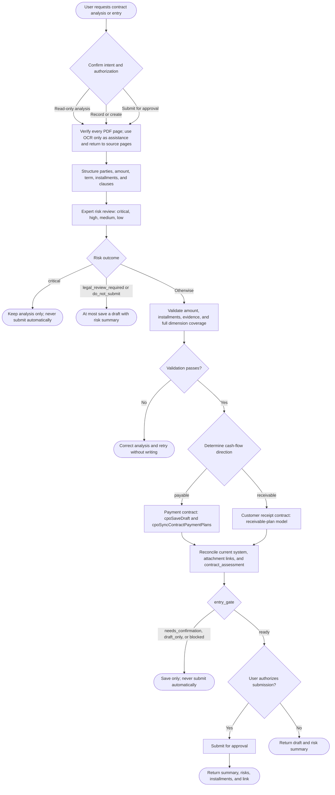

# Contract Risk Analysis and Installment Entry

Build the evidence chain before structuring clauses and reviewing risks; reconcile before writing. Never treat an inferred date, approximate party, completed approval, or workflow status as a contract fact, correct legal entity, or bank-payment fact.

## Workflow



## 1. Confirm Intent and Authorization

- “Analyze,” “inspect,” or “check” means read-only analysis with no record changes.
- “Enter,” “create,” “correct,” or “complete” authorizes a draft or the requested data correction.
- Only “submit for approval” authorizes submission; entry is not submission.
- Before writing, read [System Entry](references/system-entry.md). For every task, read [Contract Verification Rules](references/contract-review-rules.md), [Contract Risk Review](references/contract-risk-review.md), and [Output Contract](references/output-contract.md).

## 2. Verify Source Contracts

1. Confirm file existence, type, page count, and hash for every user file. Build a complete inventory and search for identical hashes or names in system attachments.
2. Render every page of PDFs/scans and visually inspect it. OCR is only an aid; verify seals, handwritten dates, account numbers, and tabular amounts against source images.
3. Inspect body, appendices, addenda, signature pages, and approval materials. Resolve conflicts by the reference evidence hierarchy.
4. Record page/clause references. Mark incomplete facts `unknown`; never fabricate them.

## 3. Build Structured Analysis

Extract at least contract name, paper/system numbers, direction, type, our role; full legal names, signature dates, effective and termination rules; deliverables, quantities, tax-inclusive amount and currency; every payment/receipt installment's amount, date, trigger, status, and evidence; invoice, refund, breach, renewal, extra-cost, confidentiality, and dispute clauses; counterparty contacts, addresses, credit code, bank and account plus missing facts; matches to current contracts, plans, payments, invoices, and attachments; and a standalone Markdown `contract_assessment` with separate objective assessment and action reminders.

## 4. Perform Expert Risk Review

Review every required dimension in [Contract Risk Review](references/contract-risk-review.md). Every risk states contract fact, consequence, recommendation, page/clause, severity, and whether it blocks submission.

- `critical`: fundamental entity, authority, amount, subject-matter, or legality problem; analysis only, with no automatic submission or payment action.
- `high`: material financial, delivery, liability, or IP loss; a risk draft may be saved on request, but legal counsel or the responsible owner must confirm.
- `medium`: ambiguous clause or weak performance control; specify addendum, evidence, or operational controls.
- `low`: minor completeness or execution reminder.

Even when no material risk is found, list every reviewed dimension and the basis for that result. For `legal_review_required` or `do_not_submit`, save at most a draft containing the risk summary.

Generate `contract.contract_assessment` in Markdown with at least `## Objective Assessment` and `## Action Items`, adding `## Risks and Treatment` when risks exist. It must stand alone, state facts, overall risk, unresolved treatment, and performance reminders, and contain no internal primary keys.

Save analysis using the [Output Contract](references/output-contract.md) and validate deterministically:

```bash
python3 <skill-dir>/scripts/validate_contract_analysis.py \
  --input "<analysis.json>" \
  --output "<validation.json>"
```

Contract total, service-item total, and installment total must reconcile; installment numbers must be unique; paid status requires evidence; all risk dimensions must be reviewed. Correct failures before any write.

## 5. Determine Direction and Ledger

- Counterparty provides goods/services and our company pays: `payable` in the vendor/payment-contract domain.
- Our company provides goods/services and the customer pays: `receivable` in the customer-contract/receivable-plan domain.
- Never infer direction from template ownership, first seal, or party labels; use payment obligations and delivery direction.
- Different companies under one brand are different legal entities. Stop automatic linking on name or bank-account mismatch.

## 6. Reconcile the Existing System

Before writing, read and confirm uniqueness: duplicate contract; exact counterparty and bank match; existing installment payment/receipt/invoice/attachment facts; historical records linked to a similar but wrong company, missing contract/plan, or wrong account snapshot; and reusable uploaded file paths.

Display conflicts by business title, contract number, or invoice number, never internal ID.

## 7. Write and Verify

- For a new payable contract, save a draft through `cpoSaveDraft`, synchronize plans with `cpoSyncContractPaymentPlans`, then proactively upload and link every inventoried contract, addendum, signature page, and approval material.
- For customer receipt contracts, use current-application customer-contract Backend Functions and the receivable-plan model.
- Store objective assessment, overall risk, key treatment, and performance reminders in Markdown `contract_assessment`; use `remark` only for application context or special terms. Keep complete risk JSON in the structured result.
- Submit only when `entry_gate=ready` and the user authorizes it. Never auto-submit `needs_confirmation`, `draft_only`, or `blocked`.
- Use controlled Backend Functions or Instant API for editable records. For locked history, cross-table cleanup, or transactional correction, return `needs_developer_migration` with business keys, expected rows, field changes, and post-write checks; do not execute database migration in this runtime Skill.
- Never use `is_deleted` as a business field in analysis, query, correction, or migration scripts. Runtime deletion uses Lovrabet model `delete` or a controlled Backend Function.
- Preserve date precision. A trigger-only installment has `NULL` date and an explicit trigger condition.
- After writing, reread contract, counterparty, installments, financial documents, invoices, and attachments. Reconcile counts, totals, states, titles, and attachment availability. Input files, successful uploads, expected links, actual links, and readback matches must agree exactly; stop submission on any mismatch.
- Dry-run any user-visible field-metadata change, then update and reread Dataset details.

## 8. Return Results

Follow the [Output Contract](references/output-contract.md): contract summary, risk decision, installment table, corrections, missing evidence, and execution status. Put risks before installments and entry results. Clearly distinguish recordable, risk-draft-only, legal-review-required, prohibited submission, and failed execution.

For a successful payable draft/submission, build `/application-detail/contract/<bizId>` from actual returned `bizType/bizId`; for a customer receipt contract use `/application-detail/crm_contract/<bizId>`. Reread details and use the contract name as clickable link text. Never return only an internal ID or use it as a fallback name.
