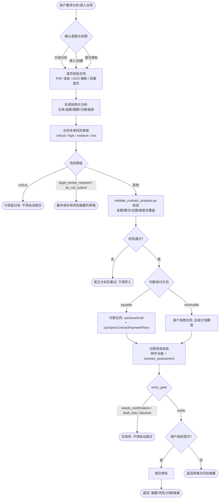

# 合同风险分析与分期入库

先建立证据链，再结构化条款和审查风险；先对账，再写入。不得把推测日期、近似主体或审批完成状态当作合同事实、正确法律主体或银行到账事实。

## 处理流程



## 1. 确认意图与权限

- 用户只说“分析、看看、检查”时，只读分析，不创建或修改记录。
- 用户明确说“录入、创建、修正、补齐”时，可以保存草稿或执行获准的数据修正。
- 只有用户明确说“提交审批”时才调用提交流程；录入不等于提交。
- 写入前读取 [system-entry.md](references/system-entry.md)；所有任务均读取 [contract-review-rules.md](references/contract-review-rules.md)、[contract-risk-review.md](references/contract-risk-review.md) 和 [output-contract.md](references/output-contract.md)。

## 2. 核验原始合同

1. 确认所有用户提供的文件存在、类型、页数和哈希，建立不遗漏的输入附件清单；查找系统中相同哈希或同名附件。
2. PDF 或扫描件必须逐页渲染并目视检查；OCR 只作辅助，印章、手写日期、账号和表格金额必须回看原页。
3. 同时检查正文、附件、补充协议、签章页及审批材料。按参考文档中的证据优先级处理冲突。
4. 记录页码或条款号，不完整内容标记为 `unknown`，不得补造。

## 3. 形成结构化分析

至少提取：

- 合同名称、纸面编号、系统归档号、收付方向、合同类型、我方角色；
- 双方完整法定名称、签章日期、生效和终止规则；
- 服务或交付项目、数量、含税金额、币种；
- 每个付款或收款节点的金额、日期、触发条件、状态和证据；
- 开票、退款、违约、自动续期、额外费用、保密和争议解决条款；
- 合作方联系人、地址、统一社会信用代码、开户行、账号及缺失项；
- 现有系统合同、计划、付款、发票和附件的匹配情况。
- 可直接写入合同主档的 Markdown 版“合同评价与注意事项”，客观评价与执行提醒必须分节表达。

## 4. 执行合同专家风险审查

按 [contract-risk-review.md](references/contract-risk-review.md) 检查全部必审维度。每项风险必须写清“合同事实、可能后果、处置建议、页码或条款”，并标记等级和是否阻断提交。

- `critical`：主体、授权、金额、标的或合法性存在根本问题；只允许保留分析，不得自动提交或触发付款。
- `high`：可能造成重大资金、交付、责任或知识产权损失；可以按用户要求保存风险草稿，但必须转法务或负责人确认。
- `medium`：条款不清或履约控制不足；列出补充条款、证据或运营控制措施。
- `low`：轻微完整性或执行提醒。

没有发现实质风险时也必须列出已检查维度和“无重大风险”的依据，不得省略风险审查。风险结论为 `legal_review_required` 或 `do_not_submit` 时，Skill 最多保存带风险摘要的草稿，不得提交审批。

同时生成 `contract.contract_assessment`，使用 Markdown 且至少包含 `## 客观评价`、`## 注意事项` 两节；存在风险时增加 `## 风险与处置`。内容应能脱离本次对话独立阅读，写明合同事实、总体风险、未完成处置和履约提醒，不写内部数据主键。

将分析结果整理为 [output-contract.md](references/output-contract.md) 定义的 JSON。运行确定性校验：

```bash
python3 <skill-dir>/scripts/validate_contract_analysis.py \
  --input "<analysis.json>" \
  --output "<validation.json>"
```

必须满足合同金额、服务项合计、分期合计一致，期次唯一，已付款状态有对应证据，并完成全部风险维度审查。校验失败时先修正分析，不得写入。

## 5. 判断收付方向与台账归属

- 对方为我方提供商品或服务、我方需要付款：`payable`，进入付款合同与供应商域。
- 我方向客户提供商品或服务、客户需要付款：`receivable`，进入客户合同与应收计划域。
- 不能根据合同在谁的模板上、谁先盖章或合同名称中的“甲乙方”猜资金方向；以资金义务和服务交付方向判断。
- 同一品牌下不同公司是不同法律主体。名称或银行账户不一致时停止自动关联。

## 6. 对账现有系统

写入前只读查询并确认唯一性：

1. 合同是否已存在或重复；
2. 合作方是否精确匹配，银行信息是否与签章合同一致；
3. 各期是否已存在付款、回款、发票或附件；
4. 历史单据是否错连相似公司、缺合同、缺期次或使用错误账户快照；
5. 原始文件是否已上传，可否复用同一文件路径建立新的业务附件关系。

发现冲突时按业务标题、合同号、发票号等展示，不得用内部 ID 作为用户标签。

## 7. 写入与复核

- 新付款合同优先通过 `cpoSaveDraft` 保存合同草稿，再用 `cpoSyncContractPaymentPlans` 同步计划，最后把输入附件清单中的合同正文、补充协议、签章页和审批材料逐个主动上传并关联到该合同申请；不等待用户追加“请上传”的指令。
- 客户收款合同使用当前应用内的客户合同 BFF 与应收计划模型，不把 CRM 当外部系统展示。
- 将用户可见的客观评价、总体风险、关键处置和履约提醒写入合同主档 `contract_assessment`，保留 Markdown 原文；`remark` 只用于申请背景、特殊约定或其他补充说明，不再承载合同专家结论。
- 完整风险 JSON 仍保留在本次结构化结果中；`contract_assessment` 是便于审批和后续履约阅读的摘要，不能替代逐项风险证据。
- `entry_gate=ready` 才可按用户授权继续提交；`needs_confirmation`、`draft_only` 或 `blocked` 均不得自动提交。
- 普通草稿和允许编辑的记录使用 Lovrabet BFF 或 Instant API；锁定历史单据、跨表清洗或需要事务的数据修正，返回 `needs_developer_migration` 并生成业务键、预期行数、变更字段和写后校验清单，不在运行时 Skill 中直接执行数据库迁移。
- `is_deleted` 属于 Lovrabet 平台系统字段。分析、录入、修正、查询和迁移脚本都不得把它当业务字段读取、筛选、补默认值或更新；运行时删除必须调用 Lovrabet 模型 `delete` 或受控 BFF。
- 有日期但仅精确到月或仅来自口述时保留精度说明；触发型节点没有日期时写 `NULL` 和明确触发条件。
- 写入后分别读取合同、合作方、分期、资金单据、发票和附件；复核条数、金额合计、状态、业务标题和附件可用性。对附件还必须逐项核对输入文件数、唯一上传成功数、预期业务关系数、实际关系数和写后读取匹配数；任何不相等或路径集合不一致都停止提交并报告缺失文件。
- 如修改用户可见字段元数据，先 dry-run，再更新并重新读取数据集详情。

## 8. 返回结果

按 [output-contract.md](references/output-contract.md) 返回：合同摘要、风险结论、分期表、已修正内容、待补证据和执行状态。风险结论置于分期和录入结果之前，明确区分“可录入”“仅可保存风险草稿”“需法务确认”“不得提交”和“执行失败”。

付款合同草稿保存或提交成功后，使用 BFF 实际返回的 `bizType/bizId` 构造 `/application-detail/contract/<bizId>`；客户收款合同成功后使用 `/application-detail/crm_contract/<bizId>`。先重读详情，再用合同名称作为可点击链接文字。不得只返回内部 ID，也不得用内部 ID 作为合同名称的兜底。
