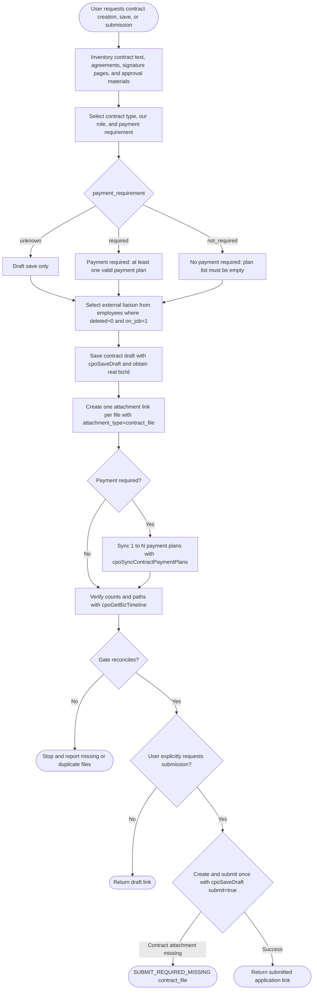

# CPO Contract Application Assistant

## Workflow



## When to Use

Use this Skill when the user wants to create, save a draft, submit, or query a CPO contract application. The corresponding form is `/contract-form`; after submission, the standard list page redirects to `/4cf8289fc0df45a4a13818fce6bfcc59`.

## Backend Boundaries

- AppCode: `app-4d050189`
- Primary Dataset: contract application `53869993f80f45ae8ef6cdf051d8e355`, table `contract_application`
- Business partner Dataset: `68c70907e27c481cbefb96dd3906936e`, table `business_partner`
- Employee source application: `app-64e32817`
- Employee Dataset: `a3da7e90ec95415f94f955e9c4906648`
- Attachment Dataset: `ab17964f0efd46f78cecb4969140f257`
- Create or update a draft only through `cpoSaveDraft`.
- Synchronize contract payment plans only through `cpoSyncContractPaymentPlans`; `cpoPaymentPlanSummary` maintains payment-fact aggregates.
- Submit for approval only by passing `submit=true` in the final confirmed, complete `cpoSaveDraft` request.
- Never directly update system-managed fields such as the contract primary record's `status`, signing time, or applicant.
- `is_deleted` is a Lovrabet system field. Skills, Backend Functions, Hooks, and scripts must not read, filter, default, or update it. Delete business records through Lovrabet `delete` or a controlled Backend Function.

## Writable Fields

In `cpoSaveDraft`, use only these fields under `values`:

- `contract_name`: required contract name.
- `direction`: pass `payable` for a payment contract on this page.
- `contract_type`: one of `sales`, `procurement`, `service`, `rent`, `hr`, `certification`, or `other`.
- `payment_requirement`: `required`, `not_required`, or `unknown`; submission cannot use `unknown`.
- `our_role`: `party_a` or `party_b`.
- `partner_id`: required business partner ID.
- `amount`: contract amount in yuan.
- `currency`: defaults to `CNY`.
- `start_date`: `YYYY-MM-DD`.
- `end_date`: `YYYY-MM-DD`.
- `liaison_user_id`: Lovrabet member ID or employee userId for the external liaison.
- `liaison_name_snapshot`: snapshot of the external liaison's name.
- `remark`: optional notes.

## Selecting the External Liaison

Select the contract's external liaison from the employee Dataset; do not manually enter a name and ID. Search `username`, `full_name`, `nickname`, `work_no`, `mobile`, and `yuntoo_email`, and keep only records with `deleted=0` and `on_job=1`.

Use the result as follows:

- `liaison_user_id` = `lovrabet_member_id`; fall back to `work_no` or the record ID when empty.
- `liaison_name_snapshot` = `full_name`; fall back to `username`, `nickname`, or `work_no` when empty.

## Create a Draft

```bash
lovrabet bff exec --appcode app-4d050189 --name cpoSaveDraft --params '{
  "bizType": "contract",
  "values": {
    "contract_name": "Example Service Contract",
    "direction": "payable",
    "contract_type": "service",
    "payment_requirement": "required",
    "our_role": "party_b",
    "partner_id": 1001,
    "amount": 200000,
    "currency": "CNY",
    "start_date": "2026-06-18",
    "end_date": "2027-06-17",
    "liaison_user_id": "<employee-userId>",
    "liaison_name_snapshot": "<employee-name>",
    "remark": "The customer requested contract review before the seal is applied"
  }
}'
```

Add `bizId` when updating an existing draft or rejected application.

## Payment Requirements and Plans

- `payment_requirement=required`: at least one valid payment plan is required before submission. A contract may have 0–N plans, and a plan may correspond to 0–N payment applications.
- `payment_requirement=not_required`: the plan list must be empty and the contract does not enter the pending-payment list. A contract with an actual payment cannot be changed to no payment required.
- `payment_requirement=unknown`: draft save only; submission is forbidden.
- Never use a `not_required` payment-plan row to represent contract-level “no payment required.”
- A plan with actual payment cannot be modified or deleted. Determine actual payment from `payment_application.payment_plan_id`, not only from compatibility field `linked_payment_application_id`.

When payment is required, save the contract draft and call `cpoSyncContractPaymentPlans` to write 1–N plans. Plan amounts do not have to equal the contract total. Record advance, final, retention, and similar installments separately with their business sequence and trigger conditions.

## Approval Status and Performance Status

Contracts have two related but distinct status axes:

- `status` is the application/approval status, such as draft, under approval, approved, signed, or cancelled.
- `lifecycle_status` is contract performance status: `pending_signature`, `signed`, `in_progress`, `completed`, or `terminated`.

Approval means only that the contract application was approved; it does not mean the contract was signed or performed. Signed versions and performance status may be maintained only through controlled contract capabilities such as `cpoManageDocument360` and `cpoSignContractVersion`. Never modify status fields directly merely to make a list show “completed.”

## Save and Submit

When the user explicitly requests submission, add `"submit":true` at the root of the complete `cpoSaveDraft` parameters. The primary Dataset CREATE triggers Lovrabet Flow. Before submission, confirm at least one contract attachment has `attachment_type=contract_file` and a non-empty `file_path`. Also confirm a definite payment requirement: required contracts need at least one valid plan, while not-required contracts must have no remaining valid plans. Do not submit when attachment counts or paths fail reconciliation. Platform Flow nodes and controlled contract capabilities handle post-approval signing and archiving; do not call legacy workflow interfaces.

## Successful Result and Detail Link

After `cpoSaveDraft` succeeds, construct the detail URL from the real `bizType` and `bizId` in that response; never reuse a guessed value. Then call `cpoGetBizTimeline` to reread title and status, and return a clickable link:

```markdown
[View the “Example Service Contract” contract application](https://app-4d050189.app.lovrabet.com/application-detail/contract/123)
```

Use the contract name as link text, never an internal ID. Say “Draft saved” for a draft and “Submitted for approval” for a submission. If the reread fails, retain the link built from the successful response and separately state that detail status has not yet been verified.

## Attachments

When the user provides contract text, an addendum, a signature page, or approval materials while creating, updating, or submitting a contract application, treat those files as intended application records. Immediately inventory them and call `lovrabet file upload` for each file; do not ask the user to say “upload attachments” again. Use only real `fileName/filePath/fileType/sourceDir` values returned by the upload. Never invent a path or put a filename in `remark` as a substitute for an attachment.

First save the contract draft to obtain its real `bizId`, then create one application relationship in the attachment Dataset for every successfully uploaded file. Contract files use `attachment_type=contract_file`:

```json
{
  "biz_type": "contract",
  "biz_id": 123,
  "attachment_type": "contract_file",
  "file_name": "contract.pdf",
  "file_path": "20260618/xxx-contract.pdf",
  "uploaded_by": "Applicant Name"
}
```

After writing attachment relationships, call `cpoGetBizTimeline` and verify by `biz_type=contract`, real `biz_id`, and `attachment_type=contract_file`. All gates must pass:

- Number of unique user-provided files belonging to this application = number of successful uploads with a non-empty `filePath`.
- Expected attachment relationships = relationships actually created = post-write relationships matching this set of `filePath` values.
- Each input filename and path is linked exactly once, with no missing, extra, or duplicate relationship.
- An existing persistent `filePath` may be reused for the same file, but a verified business attachment relationship must still be created for this application.

If any count or path set differs, stop submission and report expected and actual counts plus missing or duplicate filenames. An uploaded file that is not linked to the contract application is not complete.

## Query

```bash
lovrabet data getOne --appcode app-4d050189 --code 53869993f80f45ae8ef6cdf051d8e355 --params '{"id":123}'
lovrabet bff exec --appcode app-4d050189 --name cpoGetBizTimeline --params '{"bizType":"contract","bizId":123}'
```
