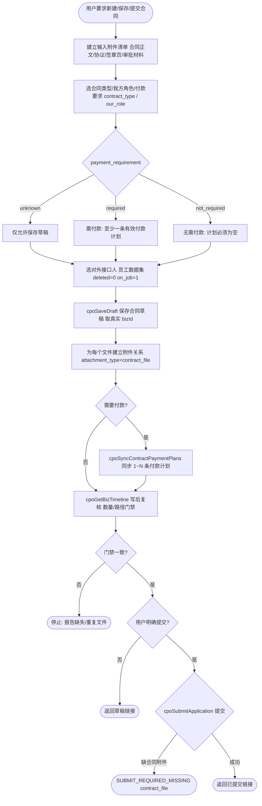

# CPO合同申请助手

## 处理流程



## 适用场景

当用户要新建、保存草稿、提交、查询 CPO 合同申请时使用本 Skill。对应前端页面是 `/contract-form`，标准列表页提交后跳转到 `/4cf8289fc0df45a4a13818fce6bfcc59`。

## 后端边界

- AppCode：`app-4d050189`
- 主数据集：合同申请 `53869993f80f45ae8ef6cdf051d8e355`，表 `contract_application`
- 商业伙伴数据集：`68c70907e27c481cbefb96dd3906936e`，表 `business_partner`
- 员工来源应用：`app-64e32817`
- 员工数据集：`a3da7e90ec95415f94f955e9c4906648`
- 附件数据集：`ab17964f0efd46f78cecb4969140f257`
- 创建/更新草稿只能调用 `cpoSaveDraft`
- 合同付款计划只能调用 `cpoSyncContractPaymentPlans` 同步；付款事实汇总由 `cpoPaymentPlanSummary` 维护
- 提交审批只能调用 `cpoSubmitApplication`
- 不要直接 update 合同主表的 `status`、签署时间、申请人等系统字段
- `is_deleted` 是 Lovrabet 平台系统字段，Skill、BF、Hook 和脚本不得读取、筛选、赋默认值或更新；删除业务记录时调用 Lovrabet `delete` 或受控 BF

## 允许写入字段

调用 `cpoSaveDraft` 时，`values` 只使用这些字段：

- `contract_name`：合同名称，必填
- `direction`：本页面付款合同传 `payable`
- `contract_type`：合同类型，值为 `sales`、`procurement`、`service`、`rent`、`hr`、`certification`、`other`
- `payment_requirement`：`required`（需要付款）、`not_required`（无需付款）、`unknown`（待确认）；提交时不能为 `unknown`
- `our_role`：我方角色，`party_a` 或 `party_b`
- `partner_id`：商业伙伴 id，必填
- `amount`：合同金额，单位元
- `currency`：默认 `CNY`
- `start_date`：开始日期，格式 `YYYY-MM-DD`
- `end_date`：结束日期，格式 `YYYY-MM-DD`
- `liaison_user_id`：对外接口人的 Lovrabet member id 或员工 userId
- `liaison_name_snapshot`：对外接口人姓名快照
- `remark`：备注说明，可选

## 对外接口人选择

合同对外接口人不是手填姓名和 id，而是从员工数据集中选择。查员工时优先搜索 `username`、`full_name`、`nickname`、`work_no`、`mobile`、`yuntoo_email`，只取 `deleted=0` 且 `on_job=1`。

返回后使用：

- `liaison_user_id` = `lovrabet_member_id`，如果为空再用 `work_no` 或记录 id
- `liaison_name_snapshot` = `full_name`，如果为空再用 `username`、`nickname`、`work_no`

## 创建草稿

```bash
lovrabet bff exec --appcode app-4d050189 --name cpoSaveDraft --params '{
  "bizType": "contract",
  "values": {
    "contract_name": "某某服务合同",
    "direction": "payable",
    "contract_type": "service",
    "payment_requirement": "required",
    "our_role": "party_b",
    "partner_id": 1001,
    "amount": 200000,
    "currency": "CNY",
    "start_date": "2026-06-18",
    "end_date": "2027-06-17",
    "liaison_user_id": "<员工userId>",
    "liaison_name_snapshot": "<员工姓名>",
    "remark": "客户要求先走合同审核后补盖章"
  }
}'
```

更新已有草稿或驳回单据时增加 `bizId`。

## 付款要求与计划

- `payment_requirement=required`：提交前至少有一条有效付款计划；一个合同可有 0～N 个计划，一个计划可对应 0～N 笔付款申请。
- `payment_requirement=not_required`：计划列表必须为空，也不会进入待付款合同；已经发生实际付款的合同不能改成无需付款。
- `payment_requirement=unknown`：只允许保存草稿，不允许提交。
- 不得用一条 `not_required` 付款计划代替合同级“无需付款”。
- 已有实际付款的计划不能修改或删除；是否已有付款以 `payment_application.payment_plan_id` 的实际明细为准，不能仅依赖兼容字段 `linked_payment_application_id`。

需要付款时，在保存合同草稿后调用 `cpoSyncContractPaymentPlans` 写入 1～N 条付款计划。计划金额不强制等于合同总额；如有预付款、尾款、质保款等，应分别记录业务期次和触发条件。

## 审批状态与履约状态

合同有两条相关但不能混用的状态轴：

- `status` 是申请/审批状态，例如草稿、审批中、已审核、已签署或已取消。
- `lifecycle_status` 是合同履约状态：`pending_signature`（待签署）、`signed`（已签署）、`in_progress`（进行中）、`completed`（已完成）、`terminated`（已终止）。

审批通过只表示合同申请已审核，不等于合同已经签署，更不等于履约完成。签署版本与履约状态只能通过 `cpoManageDocument360`、`cpoSignContractVersion` 等受控合同能力维护；不得为了让列表显示“完成”直接修改状态字段。

## 保存并提交

```bash
lovrabet bff exec --appcode app-4d050189 --name cpoSubmitApplication --params '{
  "bizType": "contract",
  "bizId": 123,
  "comment": "某某服务合同"
}'
```

提交要求 `contract` 已配置启用的第一步审批人、至少有一条 `attachment_type=contract_file` 且 `file_path` 非空的合同附件，并且付款要求已经明确：需要付款时至少有一条有效计划，无需付款时不能残留有效计划。附件缺失时 `cpoSubmitApplication` 返回 `SUBMIT_REQUIRED_MISSING:contract:contract_file`；用户已提供文件但附件数量或路径复核不一致时也不得提交。保存草稿不受服务端最低附件数限制，但本 Skill 不得保存一个遗漏用户已提供附件的草稿。审批通过后的合同签署和归档动作走 `cpoAdvanceWorkflow`，不要直接改状态。

## 成功结果与详情链接

`cpoSaveDraft` 或 `cpoSubmitApplication` 成功后，必须使用该次响应中的真实 `bizType` 和 `bizId` 构造详情地址，不得复用猜测值。随后调用 `cpoGetBizTimeline` 重读标题和状态，并在最终答复中返回可点击链接：

```markdown
[查看“某某服务合同”合同申请](https://app-4d050189.app.lovrabet.com/application-detail/contract/123)
```

链接文字使用合同名称，不显示内部 ID。保存草稿时明确写“已保存草稿”，提交时明确写“已提交审批”；即使写后重读失败，也保留按成功响应构造的链接，并单独提示详情状态尚未复核。

## 附件

用户只要在创建、更新或提交合同申请的上下文中提供合同正文、补充协议、签章页或审批材料，就视为要求随申请留档。Skill 必须立即建立输入附件清单并逐个调用 `lovrabet file upload`，不需要用户再次输入“请上传附件”。只使用上传响应中的真实 `fileName/filePath/fileType/sourceDir`，不得虚构路径或把文件名写进备注代替附件。

先保存合同草稿取得真实 `bizId`，再为每个上传成功的文件在附件数据集中创建一条申请关系。合同文件附件类型是 `contract_file`：

```json
{
  "biz_type": "contract",
  "biz_id": 123,
  "attachment_type": "contract_file",
  "file_name": "合同.pdf",
  "file_path": "20260618/xxx-合同.pdf",
  "uploaded_by": "申请人姓名"
}
```

附件落单后调用 `cpoGetBizTimeline` 重读并按 `biz_type=contract`、真实 `biz_id`、`attachment_type=contract_file` 复核。必须满足：

- 用户提供并属于该合同申请的唯一文件数 = 取得非空 `filePath` 的上传成功数
- 预期附件关系数 = 实际创建的附件关系数 = 写后读取匹配本次 `filePath` 集合的数量
- 每个输入文件的文件名和路径恰好关联一次；没有遗漏、额外附件或重复关系
- 同一文件可复用既有持久 `filePath`，但仍必须为当前合同申请建立且核实一条业务附件关系

任一数量或路径集合不一致时，停止提交并报告预期数、实际数及缺失或重复的文件名。文件上传成功但没有与合同申请关联不算完成。

## 查询

```bash
lovrabet data getOne --appcode app-4d050189 --code 53869993f80f45ae8ef6cdf051d8e355 --params '{"id":123}'
lovrabet bff exec --appcode app-4d050189 --name cpoGetBizTimeline --params '{"bizType":"contract","bizId":123}'
```
