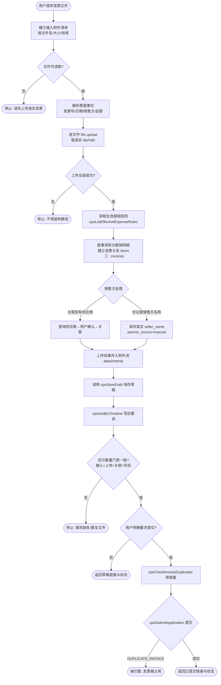

# 报销申请助手

## 处理流程



## 目标与适用场景

用于新建、保存、提交、查询和补充启智云图企业智能系统中的报销申请。对应页面为 `/expense-form`。

本 Skill 的目标是形成可审计的完整链路：报销主单、报销明细、实际使用的发票、票面销售方、发票文件和审批状态相互一致。保存草稿与提交审批是两个独立动作，任何时候都不得把“已保存”表述为“已提交”或“已通过”。

## 权威接口与数据边界

- AppCode：`app-4d050189`
- 报销申请：`7851365c96244a1896e834daec447ddb`，表 `expense_application`
- 附件信息：`ab17964f0efd46f78cecb4969140f257`，表 `attachment`
- 商业伙伴：`68c70907e27c481cbefb96dd3906936e`，表 `business_partner`
- 创建或更新草稿：只能调用 `cpoSaveDraft`
- 提交审批：只能调用 `cpoSubmitApplication`
- 读取生效报销规则：只能调用 `cpoListEffectiveExpenseRules`
- 查询详情：只能调用 `cpoGetBizTimeline`
- 查询草稿：可调用 `cpoGetMyDrafts`
- 提交前查重：可调用 `cpoCheckInvoiceDuplicates`；最终提交仍会在服务端再次查重

不得直接调用 `data create/update/delete/batchCreate` 写报销主表、报销明细、发票台账或发票关联表。标准写接口已有 Hook 封堵，页面禁用仅用于交互提示，权限边界在 Backend Function 和 Hook。

`is_deleted` 是 Lovrabet 平台系统字段。Skill、页面、Backend Function、Hook 和脚本都不得读取、筛选、赋默认值或更新该字段；删除必须调用 Lovrabet 模型的 `delete`。

## 标准处理流程

1. 确认用户已经提供可读取的真实发票文件，并按文件名、大小及可用哈希建立输入附件清单；没有文件时停止创建或提交，请用户先上传，不能提出“先登记、以后补发票”
2. 读取并解析清单中的每个发票文件，提取发票号码、日期、销售方、金额等票面事实
3. 对清单中的每个唯一文件调用 `lovrabet file upload`，取得运行时返回的真实 `filePath`；上传失败时停止，不能虚构路径或继续保存
4. 调用 `cpoListEffectiveExpenseRules` 读取当前生效规则
5. 按业务事项拆分报销明细，不把多条明细拼进主单备注
6. 为每条明细建立明确的 `items[].invoices` 发票关系，并把对应上传结果写入 `items[].invoices[].file_path`
7. 识别票面销售方，并处理“关联现有供应商”或“仅记录销售方名称”
8. 把所有上传结果同时放入 `cpoSaveDraft.attachments`，让 Backend Function 保存为报销主单的统一附件池；同一文件只上传一次
9. 调用 `cpoSaveDraft` 保存草稿，检查响应中的 `attachments` 与上传结果路径一致
10. 调用 `cpoGetBizTimeline` 重读，确认每张发票的 `file_path` 与报销附件池中的同路径文件都存在
11. 按输入附件清单逐项核对输入、上传、关联和写后读取数量及路径集合，任何缺失、额外或重复都必须停止
12. 用户明确要求提交时，先展示查重结果；只有附件、发票关系、路径和数量复核全部通过后才调用 `cpoSubmitApplication`

缺少会改变报销金额、供应商关系或提交意图的关键信息时应询问用户；不得猜测。

## 报销主单与明细契约

`cpoSaveDraft.values` 只传以下业务字段：

- `expense_type`：报销类型。可选值以系统业务字典为准，不在 Skill 中永久硬编码
- `travel_type`：差旅报销时必填，值为 `domestic` 或 `overseas`
- `title`：明确的业务标题，必填
- `total_original_amount`：原始消费合计，单位元
- `total_cny_amount`：折算人民币合计，单位元
- `reimbursable_cny_amount`：最终可报销金额，单位元
- `payout_currency`：固定为 `CNY`
- `remark`：主单补充说明，可选

不要传 `status`、`applicant_user_id`、`applicant_name_snapshot`、`submitted_at` 等系统字段。报销款默认发放至申请人的工资卡，不要询问、采集或传递员工银行卡号和开户行。

报销明细通过 `items` 传入：

- `id`：更新已有草稿时原样带回；新明细不传
- `description`：简短且可识别的业务说明
- `cny_amount`：票据人民币金额
- `reimbursable_cny_amount`：按生效规则计算的实际报销金额
- `invoices`：该明细实际使用的发票数组，一条明细可关联多张发票
- `remark`：规则命中、折扣依据、文件名等补充信息

主单合计由 Backend Function 根据明细重新汇总。Agent 不得依赖备注、标题或舱位字段让服务端猜测报销金额。

## 发票关联、销售方与供应商

### 发票关系

发票必须通过 `items[].invoices` 明确传递，不能只把发票号或文件名写进 `remark`。

- 台账已有发票时优先传 `invoice_id`
- 台账没有记录时传 `invoice_no`、`seller_name`、金额和文件路径，`cpoSaveDraft` 会先建立草稿台账再关联
- 报销新建的票据由服务端固定登记为进项发票和报销用途
- `biz_invoice_link` 中 `biz_type=expense_item` 的记录是一对多关系权威数据
- `expense_item.invoice_id` 只保存第一张实际票据，用于兼容旧页面

### 票面销售方是事实，供应商关联是可选关系

| 场景 | `seller_name` | `partner_id` | `partner_source` | `partner_name_snapshot` |
|---|---|---|---|---|
| 关联现有供应商 | 票面真实名称 | 已确认的供应商记录 | `business_partner` | 供应商名称 |
| 仅记录销售方名称 | 票面真实名称 | 不传 | `manual` | 与 `seller_name` 相同 |

“仅记录销售方名称”表示不创建、不关联供应商主数据，不是临时供应商，也不表示以后必须转为供应商。只要销售方名称完整，它就是有效发票信息，不能提示“交易对手待补”。

新建发票台账时必须提供真实 `seller_name`，不得使用“发票”“票据”“供应商”等泛化占位名称。

### 匹配供应商

按企业名称或统一社会信用代码查询启用的供应商、服务商和个人往来方：

```bash
lovrabet --appcode app-4d050189 data filter \
  --code 68c70907e27c481cbefb96dd3906936e \
  --params '{
    "where": {
      "$and": [
        {"partner_type":{"$in":["supplier","service_provider","individual"]}},
        {"status":{"$eq":"active"}},
        {"$or":[
          {"name":{"$contain":"阿里云"}},
          {"unified_credit_code":{"$contain":"阿里云"}}
        ]}
      ]
    },
    "select":["id","name","partner_type","unified_credit_code","status"],
    "currentPage":1,
    "pageSize":20
  }'
```

处理规则：

1. 唯一精确匹配时，展示企业名称并在用户确认后关联
2. 多个候选或只有模糊匹配时，按企业名称和统一社会信用代码让用户选择，不显示内部 ID 作为标签
3. 没有匹配项时，询问“新建供应商并关联”或“仅记录销售方名称（不关联供应商）”
4. 只有用户明确选择新建时才调用系统商业伙伴创建能力
5. 不得为了完成报销而静默创建供应商，也不得把销售方名称缺失的问题伪装成供应商主数据问题

### 发票文件

用户提供的发票文件是创建和提交报销的前置输入，不是可选的后补材料。Skill 必须主动完成文件上传和附件落单，不需要用户再输入“请把发票一起提交”等额外指令。

先上传每一个本地发票文件：

```bash
lovrabet file upload \
  --appcode app-4d050189 \
  --file "/workspace/invoice.pdf" \
  --format json
```

只使用上传响应中的真实 `data.fileName`、`data.filePath`、`data.fileType` 和 `data.sourceDir`。发票或凭证文件只上传一次；报销附件池和明细发票共同复用该文件的真实 `filePath`。

- 报销主单附件保存为 `attachment_type=approval_material`
- `cpoSaveDraft.attachments[].filePath` 必须使用上传响应中的真实路径
- `items[].invoices[].file_path` 必须与对应 `attachments[].filePath` 完全一致
- 不要为同一文件重复创建 `attachment_type=invoice` 附件
- 不得虚构文件路径
- 不得只把发票号码、文件名或“后续补录”说明写入备注来代替文件上传
- 不得在发票台账缺少 `file_path` 时继续提交，也不得承诺提交后再补录发票台账
- 文件上传、附件保存或写后路径复核任一步失败时，停止提交并明确报告失败环节

附件数量必须显式清点，不能只检查“至少有一个附件”：

- `input_file_count` 是用户本次提供并属于该报销单的唯一文件数；同名文件要结合大小或哈希判断，不能仅按文件名误去重
- `uploaded_file_count` 是取得非空真实 `filePath` 的唯一上传结果数
- `associated_attachment_count` 是 `cpoSaveDraft` 返回且路径属于本次上传集合的附件数；每个输入文件还必须恰好出现在对应发票关系中
- `readback_match_count` 是 `cpoGetBizTimeline` 写后读取时，同时在发票台账和报销附件池中匹配到的本次路径数
- 必须满足 `input_file_count = uploaded_file_count = associated_attachment_count = readback_match_count`，并且四方文件名与 `filePath` 集合一一对应、无遗漏、无额外项、无重复关系
- 任一数量或路径集合不一致时，不得提交；向用户报告预期数、实际数和缺失或重复的文件名。文件上传成功但未关联到该申请单不算成功

查询已有报销时，以 `expenseItems[].invoice_links[].invoice` 为发票事实：

- `partner_id` 为空不等于缺发票，也不等于销售方缺失
- 只有 `seller_name` 与 `partner_name_snapshot` 都为空时，才提示销售方信息待补
- 附件完整性以 `invoice.file_path` 以及报销附件池中的同路径文件为准

## 生效报销规则

自动录入、审核辅助或解释报销金额前必须读取当前规则：

```bash
lovrabet --appcode app-4d050189 bff exec \
  --name cpoListEffectiveExpenseRules \
  --params '{"expenseType":"travel","category":"flight"}'
```

按 `priority` 从小到大判断：

- `ratio`：`reimbursable_cny_amount = cny_amount * reimburse_ratio`
- `full`：实际报销金额等于票据金额
- `fixed_limit`：实际报销金额不超过 `limit_amount`
- `manual_review`：不强行计算，注明待人工确认
- 多条规则匹配时优先使用更小的 `priority`
- 没有生效规则时停止自动计算，提示先维护报销规则

把命中的 `rule_code` 或 `rule_name` 写入明细备注。制度以规则表为准，不在 Skill 中永久硬编码某舱位比例、费用封顶或通信费政策。

## 创建或更新草稿

```bash
lovrabet --appcode app-4d050189 bff exec \
  --name cpoSaveDraft \
  --params '{
    "bizType":"expense",
    "values":{
      "expense_type":"telecom",
      "title":"7 月公司固话通信费报销",
      "total_original_amount":298.40,
      "total_cny_amount":298.40,
      "reimbursable_cny_amount":298.40,
      "payout_currency":"CNY"
    },
    "items":[{
      "description":"公司固话通信费",
      "cny_amount":298.40,
      "reimbursable_cny_amount":298.40,
      "invoices":[{
        "invoice_no":"26337000000680239545",
        "invoice_date":"2026-08-03",
        "seller_name":"中国电信股份有限公司杭州分公司",
        "partner_source":"manual",
        "partner_name_snapshot":"中国电信股份有限公司杭州分公司",
        "total_amount":298.40,
        "file_path":"20260803/26337000000680239545.pdf"
      }],
      "remark":"命中当前生效的公司通信费规则"
    }],
    "attachments":[{
      "fileName":"26337000000680239545.pdf",
      "filePath":"20260803/26337000000680239545.pdf",
      "fileType":"application/pdf"
    }]
  }'
```

`attachments[].filePath` 与对应 `items[].invoices[].file_path` 必须来自同一次文件上传响应并完全一致。`cpoSaveDraft` 返回后，必须确认 `attachments` 中包含同一路径；响应未返回附件或路径不一致时不得继续提交。

更新草稿或驳回后重提前，先调用 `cpoGetBizTimeline`，把需要保留的 `expenseItems[].id` 和 `invoice_links` 转回 `items[].id`、`items[].invoices`。传入 `items` 后，Backend Function 会增量同步明细、发票台账及关联；遗漏的旧明细和旧关联会通过 Lovrabet `delete` 删除。

## 查重与提交

保存草稿后可先查重：

```bash
lovrabet --appcode app-4d050189 bff exec \
  --name cpoCheckInvoiceDuplicates \
  --params '{"expenseId":123}'
```

只有用户明确要求提交时才调用：

```bash
lovrabet --appcode app-4d050189 bff exec \
  --name cpoSubmitApplication \
  --params '{"bizType":"expense","bizId":123,"comment":"7 月公司固话通信费报销"}'
```

`cpoSubmitApplication` 会再次执行发票查重。发现同单重复、重复台账或发票已被其他有效报销占用时会返回 `DUPLICATE_INVOICE` 并拒绝提交。缺少启用的第一步审批人时会返回 `WORKFLOW_CONFIG_MISSING` 或 `WORKFLOW_STEP_ASSIGNEE_MISSING`。

提交时每条报销明细都必须关联至少一张实际发票；每张发票都必须有非空 `file_path`，且同一路径必须存在于报销主单的 `attachment_type=approval_material` 附件池中。缺少附件时返回 `SUBMIT_REQUIRED_MISSING:expense:approval_material`，缺少明细发票或发票文件时返回相应 `SUBMIT_REQUIRED_MISSING:expense:*`，发票路径与附件池不一致时返回 `SUBMIT_CONFLICT:expense:invoice_attachment:*`。

服务端允许页面保存尚未补全的普通草稿，但本 Skill 处理“根据发票创建报销”时不得利用这一宽松边界：没有成功上传并落单的发票文件，就不能创建报销草稿，更不能提交审批。

## 写后复核与结果表达

```bash
lovrabet --appcode app-4d050189 bff exec \
  --name cpoGetBizTimeline \
  --params '{"bizType":"expense","bizId":123}'
```

复核以下事实：

- 主单标题、金额和状态
- 每条报销明细及实际报销金额
- `invoice_links` 数量、发票号码和分摊金额
- `seller_name`、可选的供应商关系与 `partner_name_snapshot`
- 发票 `file_path` 与报销附件池路径一致
- 输入、上传、附件关联和写后读取的文件数量完全一致，且逐个文件路径可追溯

最终使用保存或提交响应中的真实 `bizType` 和 `bizId` 构造详情链接，链接文字使用报销标题，不把内部 ID 当作用户可见标签：

```markdown
[查看“7 月公司固话通信费报销”](https://app-4d050189.app.lovrabet.com/application-detail/expense/123)
```

状态表达：

- `draft`：草稿，可继续编辑
- `submitted`：已提交，正在审批
- `rejected`：已驳回，可修改后重新提交
- `reviewed` 及后续状态：普通申请人不可编辑；仍应按当前任务判断流程是否结束
- 作废或撤回调用 `cpoApplicantFlowAction`，不要直接修改 `status`

如果写后重读失败，仍可返回按成功响应构造的链接，但必须明确哪些金额、状态或关联尚未复核。
