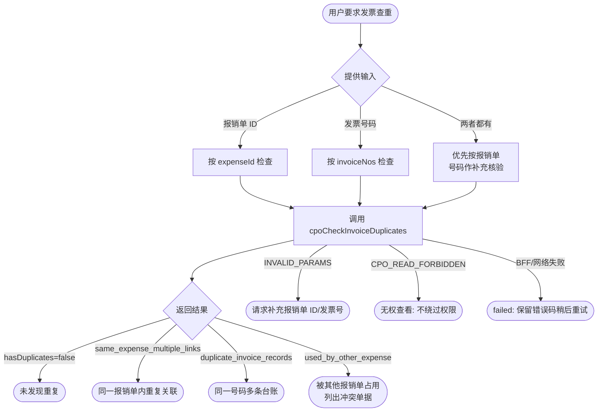

# CPO 发票查重

执行前读取并遵守 [runtime-contract.md](references/runtime-contract.md) 和 [output-contract.md](references/output-contract.md)。

## 处理流程



## 使用边界

- 只检查 CPO 应用 `app-4d050189` 中的发票重复使用情况。
- 支持按报销单 ID 检查，或按一个或多个发票号码检查。
- 只调用服务端 `cpoCheckInvoiceDuplicates`，不得自行组合 Instant API 查询推断结果。
- 不创建、更新、删除发票、报销明细或发票关联。
- 报销提交由 `cpoSubmitApplication` 在服务端再次强制查重；本 Skill 的预查不能代替提交校验。

## 输入

至少提供一项：

- 报销单 ID，例如 `14`；或
- 发票号码，例如 `26337000000590589880`；可提供多个。

输入同时包含报销单 ID 和发票号码时，优先按报销单检查，并把指定号码作为补充核验范围。

## 查重

按报销单检查：

```bash
lovrabet bff exec --appcode app-4d050189 --name cpoCheckInvoiceDuplicates --params '{"expenseId":14}' --format compress
```

按发票号码检查：

```bash
lovrabet bff exec --appcode app-4d050189 --name cpoCheckInvoiceDuplicates --params '{"invoiceNos":["26337000000590589880"]}' --format compress
```

只读取 BFF 返回的业务对象。不得把命令外层信封、CLI 日志或本地缓存当作查重结论。

## 结果解释

- `hasDuplicates=false`：当前检查范围未发现重复。
- `same_expense_multiple_links`：同一报销单内重复关联同一张发票。
- `duplicate_invoice_records`：同一发票号码存在多条有效发票台账。
- `used_by_other_expense`：发票已被其它当前有效且未取消的报销单占用；记录可见性由 Lovrabet 平台统一处理，Skill 不拼接系统字段过滤条件。
- `conflictingExpenses`：冲突报销单，展示 `expenseId`、标题、状态和提交时间。

如果发票没有号码，只能按报销单 ID 检查其发票记录 ID 是否重复占用；不要根据文件名猜测发票号码。

## 输出

按 [output-contract.md](references/output-contract.md) 返回只读结论。发现重复时必须明确列出发票号码、原因和冲突报销单；不得把“未查到台账”写成“确认不重复”。

## 失败处理

- `INVALID_PARAMS`：请求用户补充报销单 ID 或发票号码。
- `CPO_READ_FORBIDDEN`：说明当前账号无权查看相关单据，不尝试绕过权限。
- BFF 或网络失败：返回 `failed`，保留原始错误码，建议稍后重试。
- 返回结构不完整：返回 `needs_manual_check`，不要给出“不重复”结论。
