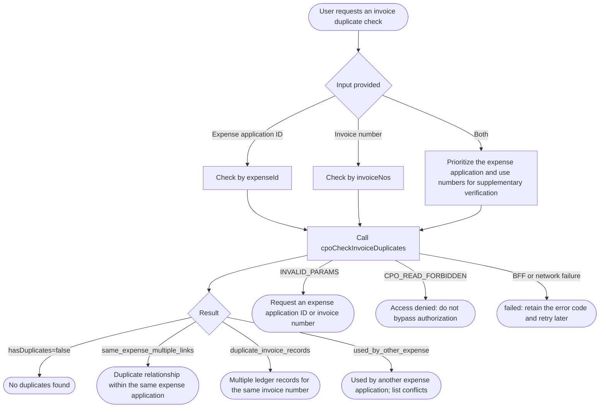

# CPO Invoice Duplicate Check

Before execution, read and follow [runtime-contract.md](references/runtime-contract.md) and [output-contract.md](references/output-contract.md).

## Workflow



## Scope and Boundaries

- Only checks duplicate invoice usage in CPO application `app-4d050189`.
- Supports checking by expense application ID or by one or more invoice numbers.
- Only calls the server-side `cpoCheckInvoiceDuplicates`; do not infer results by composing Instant API queries.
- Does not create, update, or delete invoices, expense items, or invoice relationships.
- `cpoSaveDraft(submit=true)` performs another mandatory server-side duplicate check during expense submission. This Skill's preliminary check does not replace submission validation.

## Input

Provide at least one of the following:

- An expense application ID, such as `14`; or
- An invoice number, such as `26337000000590589880`. Multiple numbers are allowed.

When both an expense application ID and invoice numbers are provided, check by expense application first and use the specified numbers as a supplementary verification scope.

## Duplicate Check

Check by expense application:

```bash
lovrabet bff exec --appcode app-4d050189 --name cpoCheckInvoiceDuplicates --params '{"expenseId":14}' --format compress
```

Check by invoice number:

```bash
lovrabet bff exec --appcode app-4d050189 --name cpoCheckInvoiceDuplicates --params '{"invoiceNos":["26337000000590589880"]}' --format compress
```

Only consume the business object returned by the Backend Function. Do not treat the command envelope, CLI logs, or local cache as the duplicate-check result.

## Result Interpretation

- `hasDuplicates=false`: no duplicate was found within the checked scope.
- `same_expense_multiple_links`: the same invoice is related more than once within one expense application.
- `duplicate_invoice_records`: more than one active invoice ledger record exists for the same invoice number.
- `used_by_other_expense`: the invoice is already used by another currently active and non-cancelled expense application. Record visibility is handled by Lovrabet; the Skill must not construct filters involving platform-managed fields.
- `conflictingExpenses`: conflicting expense applications. Show the `expenseId`, title, status, and submission time.

If an invoice has no number, it can only be checked by expense application ID to determine whether its invoice record ID is used more than once. Do not guess an invoice number from the file name.

## Output

Return a read-only conclusion according to [output-contract.md](references/output-contract.md). When duplicates are found, explicitly list each invoice number, reason, and conflicting expense application. Do not describe a missing ledger record as confirmation that the invoice is not duplicated.

## Failure Handling

- `INVALID_PARAMS`: ask the user for an expense application ID or invoice number.
- `CPO_READ_FORBIDDEN`: explain that the current account cannot view the relevant record; do not bypass authorization.
- Backend Function or network failure: return `failed`, preserve the original error code, and recommend retrying later.
- Incomplete response structure: return `needs_manual_check`; do not conclude that there is no duplicate.
