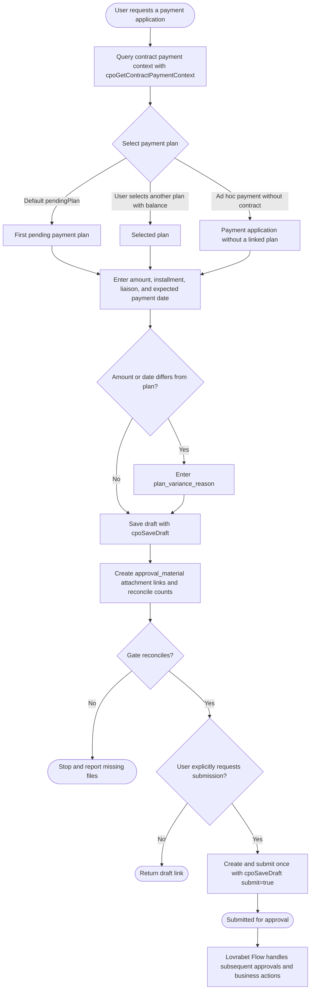

# Payment Application Assistant

## Workflow



## When to Use

Use this Skill to create, save a draft, submit, or query a payment application, or to initiate payment from a contract payment plan. The form is `/payment-form`; after submission, the standard list page redirects to `/ce56ba4ceec8471cbddf4068ea9c397a`.

## Backend Boundaries

- AppCode: `app-4d050189`
- Primary Dataset: payment application `7da208a5059b4b13896d7c7ae29c8492`, table `payment_application`
- Contract payment plan Dataset: `08e17d8ba3a24e938fef89816c8f4ccb`, table `contract_payment_plan`
- Contract application Dataset: `53869993f80f45ae8ef6cdf051d8e355`
- Business partner Dataset: `68c70907e27c481cbefb96dd3906936e`
- Attachment Dataset: `ab17964f0efd46f78cecb4969140f257`
- Create or update a draft only through `cpoSaveDraft`.
- Query contracts, payment plans, the first pending plan, and payment history only through `cpoGetContractPaymentContext`.
- Synchronize draft contract payment plans only through `cpoSyncContractPaymentPlans`.
- Submit only by passing `submit=true` in the final confirmed, complete `cpoSaveDraft` request. Do not create a draft and then call a legacy submission interface.
- Lovrabet Flow nodes and the `cpoFlowBizStateSync` callback handle voucher preparation, bank submission, payment confirmation, and later actions.
- Never directly update `status`, `bank_status`, or bank-confirmation fields on payment applications, or `status`, `linked_payment_application_id`, or actual-payment fields on payment plans.
- `is_deleted` is a Lovrabet system field. Skills, Backend Functions, Hooks, and scripts must not read, filter, default, or update it. Delete records through Lovrabet `delete` or a controlled Backend Function.

## Writable Fields

In `cpoSaveDraft`, use only these fields under `values`:

- `partner_id`: payee business partner ID.
- `contract_id`: optional linked contract ID.
- `payment_plan_id`: optional contract payment plan ID. The server validates that it belongs to the selected contract, is not cancelled, and still permits payment. Multiple payment applications may use one installment.
- `payment_type`: `contract_payment`, `reimbursement`, `vendor_payment`, `certification`, `cloud`, `telecom`, or `other`.
- `title`: required payment title.
- `amount`: payment amount in yuan.
- `planned_amount_snapshot`: plan amount snapshot, overwritten by the server from the selected plan.
- `currency`: defaults to `CNY`.
- `payment_phase_no`: installment number.
- `payment_phase_name`: installment name.
- `total_phase_count`: total number of installments.
- `phase_trigger_condition`: trigger condition.
- `liaison_user_id`: liaison ID.
- `liaison_name_snapshot`: liaison name snapshot.
- `expected_pay_date`: `YYYY-MM-DD HH:mm:ss`.
- `planned_pay_date_snapshot`: planned payment date snapshot, overwritten by the server from the selected plan.
- `plan_variance_reason`: reason that amount or date differs from the plan.
- `bank_account_snapshot`: payee bank-account snapshot.
- `remark`: optional notes.

## Link a Contract

The payment form offers only contracts with status `submitted`, `reviewed`, or `signed`. After selecting a contract, query its payment context:

```bash
lovrabet bff exec --appcode app-4d050189 --name cpoGetContractPaymentContext --params '{
  "contractId": 123
}'
```

The response contains:

- `plans`: all valid plans ordered by `phase_no`.
- `pendingPlan`: the first `pending` or `processing` plan with an unapplied balance; use it by default.
- `paymentHistory`: historical payment applications for the contract.

Do not create a contract payment when `payment_requirement=not_required`. If payment is required but no plan exists, complete the plan first. Create an unlinked application only for a genuine ad hoc payment without a contract. When the user explicitly chooses another plan with remaining balance, use that plan instead of forcing the first one.

Save 0–N plans with `cpoSyncContractPaymentPlans`:

```bash
lovrabet bff exec --appcode app-4d050189 --name cpoSyncContractPaymentPlans --params '{
  "contractId": 123,
  "plans": [
    {
      "phase_no": 1,
      "phase_name": "Initial Payment",
      "planned_amount": 50000,
      "currency": "CNY",
      "planned_pay_date": "2026-08-31",
      "trigger_condition": "After contract signing",
      "status": "pending"
    }
  ]
}'
```

Business-selectable `status` values:

- `pending`: awaiting payment and included in the automatic payment queue.
- `paid`: already paid, for payments completed before the contract application.
- `not_required`: no payment required.

`processing` and `cancelled` are system states and cannot be created by a contract save request. Plans may be synchronized only for `draft` or `rejected` contracts. A `pending`, `paid`, or `not_required` plan without an actual payment application may still be corrected or deleted; plans with actual payments cannot be deleted or rewritten. Manually setting `paid` records a plan fact only and does not fabricate payment-application history.

## Create a Draft

```bash
lovrabet bff exec --appcode app-4d050189 --name cpoSaveDraft --params '{
  "bizType": "payment",
  "values": {
    "partner_id": 1001,
    "contract_id": 123,
    "payment_plan_id": 456,
    "payment_type": "contract_payment",
    "title": "Initial Service Fee Payment",
    "amount": 50000,
    "currency": "CNY",
    "expected_pay_date": "2026-08-31 00:00:00",
    "bank_account_snapshot": "Bank / Account Name / Account Number",
    "remark": "Vendor requests payment before month-end"
  }
}'
```

Add `bizId` when updating an existing draft or rejected application.

When `payment_plan_id` is supplied, `cpoSaveDraft` fills `contract_id`, installment number/name/count, trigger condition, planned amount snapshot, and planned date snapshot from the plan. `amount` and `expected_pay_date` remain editable. If one application or the cumulative applied amount exceeds the plan amount, `plan_variance_reason` is required. After saving, `cpoPaymentPlanSummary` recalculates processing, paid, and remaining amounts from all valid applications under the plan. Compatibility field `linked_payment_application_id` stores only the latest application and is not the unique relationship.

## Payment and Incoming-invoice Allocation

Payment and invoicing are independent facts, and the system must not enforce a fixed order:

- An invoice may arrive before payment, or payment may occur before the vendor supplies the invoice.
- One payment may be covered by 0–N incoming invoices, and one incoming invoice may cover 0–N payments by allocated amount.
- A payment may be submitted before the invoice arrives, but details must show the outstanding invoice amount. Allocate the real invoice after receipt; never fabricate an invoice number or attachment.
- Cumulative allocations cannot exceed the payment amount or the invoice face amount.
- For example, if an initial payment is 5,500, the vendor later issues one invoice for 9,500, and a second payment is 4,000, allocate that same real invoice as 5,500 to the first payment and 4,000 to the second.

When archiving an incoming invoice, the invoice capability may pass `paymentAllocations` with `cpoSaveDraft`. Administrators may later add or remove allocation through `cpoManageDocument360` actions `allocate_invoice` and `remove_invoice_allocation`. Allocation facts come from `biz_invoice_link.relation_type=payment_coverage`, never from notes or attachment filenames.

## Save and Submit

When the user explicitly requests submission, add `"submit":true` at the root of the complete `cpoSaveDraft` parameters. The primary Dataset CREATE triggers Lovrabet Flow. Do not call a legacy second-step submission interface. If the user supplied payment materials, upload and reconcile them before the first creation; never ignore attachments and continue to submit.

## Successful Result and Detail Link

After `cpoSaveDraft` succeeds, construct the detail URL from the real `bizType` and `bizId` in that response, then call `cpoGetBizTimeline` to reread title, amount, and status. Return:

```markdown
[View the “Initial Service Fee Payment” payment application](https://app-4d050189.app.lovrabet.com/application-detail/payment/123)
```

Use the payment title as link text, never an internal ID. Say “Draft saved” or “Submitted for approval” accurately. If rereading fails, still return the link built from the successful response and state that amount or status has not yet been verified.

## Attachments

A payment application may legitimately have no materials. However, when the user provides a contract payment basis, acceptance materials, payment notice, or similar file in the context of creating, updating, or submitting an application, treat it as intended application documentation. Proactively inventory and upload every file with `lovrabet file upload`; do not wait for another upload instruction. Use only real `fileName/filePath/fileType/sourceDir` values returned by upload.

First save the payment draft to obtain its real `bizId`, then create one attachment relationship per file. Payment materials use `attachment_type=approval_material`:

```json
{
  "biz_type": "payment",
  "biz_id": 123,
  "attachment_type": "approval_material",
  "file_name": "payment-materials.pdf",
  "file_path": "20260618/xxx-payment-materials.pdf",
  "uploaded_by": "Applicant Name"
}
```

Then call `cpoGetBizTimeline` and compare this path set by `biz_type=payment`, real `biz_id`, and `attachment_type=approval_material`. Unique user files must equal unique successful uploads; expected relationships must equal actual created relationships and matching relationships in the post-write read. Every filename and `filePath` must appear exactly once, with no missing, extra, or duplicate link. A reused persistent path still requires a verified relationship to this payment application.

If any count or path differs, stop submission and report expected and actual counts plus missing or duplicate filenames. Uploading to file storage without linking the file to the payment application is not success, and a filename in notes is not an attachment.

Bank receipts and payment confirmation must be processed at the corresponding Lovrabet Flow nodes, with `cpoFlowBizStateSync` writing back business status. Never modify primary-table bank fields directly. Controlled business callbacks maintain actual-payment aggregates; the Agent must not call custom workflow-action interfaces.

## Query

```bash
lovrabet data getOne --appcode app-4d050189 --code 7da208a5059b4b13896d7c7ae29c8492 --params '{"id":123}'
lovrabet bff exec --appcode app-4d050189 --name cpoGetBizTimeline --params '{"bizType":"payment","bizId":123}'
lovrabet bff exec --appcode app-4d050189 --name cpoGetContractPaymentContext --params '{"contractId":456}'
```
