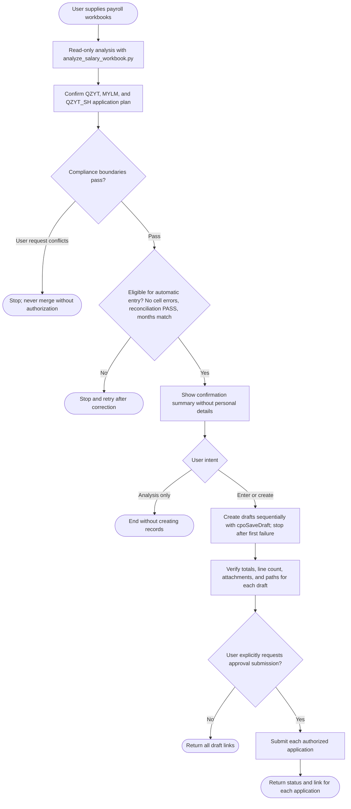

# Create Payroll Payment Applications from Excel

Perform read-only analysis and reconciliation before creating drafts. Never output employee names or individual compensation, and never submit without explicit authorization.

## Workflow



## 1. Analyze Excel

Confirm all files exist and use `.xlsx`. One or more files are allowed:

```bash
python3 <skill-dir>/scripts/analyze_salary_workbook.py \
  "<absolute-path-to-QZYT-and-Shanghai-payroll>" \
  "<absolute-path-to-MYLM-payroll>" \
  --output "<temporary-JSON-readable-only-by-current-user>"
```

The script reads OOXML directly and outputs only entity-level aggregates, control rows, reconciliation, and application plans by default—never employee details. Follow [Workbook Rules](references/workbook-rules.md) for amount precedence, entity mapping, and reconciliation.

For an explicitly requested application order, add `--application-groups`. Separate applications with semicolons; Shanghai Branch payroll and tax intercompany payment must remain separate:

```bash
python3 <skill-dir>/scripts/analyze_salary_workbook.py \
  "<payroll-1>" "<payroll-2>" \
  --application-groups "QZYT;MYLM;QZYT_SH" \
  --output "<temporary-JSON-readable-only-by-current-user>"
```

## 2. Confirm the Application Plan

Read `application_plan` and `application_drafts` first:

- Default to three business purposes: `QZYT`, `MYLM`, and `QZYT_SH`.
- `QZYT` covers Qizhi Yuntu headquarters payroll; `MYLM` covers Meiyou Liuma payroll.
- `QZYT_SH` is an intercompany payment from Qizhi Yuntu to its Shanghai Branch for employee payroll and individual income tax, and must remain separate.
- Never merge Qizhi Yuntu and Meiyou Liuma approval entities.
- Never merge the Shanghai Branch payroll/tax intercompany payment into headquarters payroll.
- Each application retains only source files covering its payment items. The same source file may be retained separately by multiple applications.

Show application count, title, approval entity, payment items, and attachments. Stop if the user's requested grouping conflicts with these boundaries.

## 3. Determine Automatic-entry Eligibility

Require:

- `analysis.cell_errors` is empty.
- Every workbook `reconciliations` entry is `PASS`.
- Every amount is greater than zero.
- Every entity matches live master data by code and full legal name.
- All files use the same payroll month.
- Every original workbook can be uploaded as an attachment.

`checks.status = REVIEW` is not always blocking. If a known entity is absent from the whole batch, warn that this month's attachments omit it; never generate a zero-amount item.

## 4. Show the Confirmation Summary

For each `application_drafts` entry, show sequence, title, approval entity, payroll month, default payment date, company/amount/headcount/basis for each item, total amount/headcount/item count, required source filenames, and warnings.

Never show employee names, individual salary amounts, ID numbers, bank-account numbers, or other personal information. If the user asked only to analyze or inspect, stop here without creating records.

## 5. Create Payroll Payment Drafts

When the user asks to enter data or create applications, follow [Application Contract](references/application-contract.md).

1. Query live internal legal entities and replace script ID hints.
2. Inventory the whole batch by filename, size, and available hash. Process `application_drafts` in order and proactively upload or reuse every source file in each draft's `attachments`.
3. Pass complete `values/items` and upload results to `cpoSaveDraft`. One source upload may be reused, but every application needs its own attachment relationship.
4. Save drafts sequentially by default. On failure, stop remaining creation and report created drafts by business title and detail link, never internal ID.
5. Reread every draft and verify primary total, item count, each amount, attachment count, and previewability. Across the batch, reconcile unique input and upload counts; per application, reconcile expected relationships, saved relationships, and readback matches.

If no authenticated upload capability is available, stop at the confirmation summary and never create drafts without attachments.

## 6. Submit for Approval

Only when the user explicitly requests approval submission, call complete `cpoSaveDraft` with `submit=true` for each authorized application. Show the final summary first and recheck batch- and application-level attachment counts and path sets. Never create a draft and then call a legacy submit interface; never submit other applications when the user authorized only one.

## 7. Success Result and Detail Links

After each successful `cpoSaveDraft`, use its real `bizId` to build the payroll-payment detail URL. Call `cpoGetBizTimeline` to reread title, total, item count, attachment count, and status:

```markdown
[View “Hangzhou Qizhi Yuntu Technology Co., Ltd. July 2026 Employee Payroll”](https://app-4d050189.app.lovrabet.com/application-detail/salary_payment/123)
```

Return one link per application, using each business title and no internal ID. Distinguish save from submission. If readback fails for one application, retain its link from the successful response and list the unverified facts under that application.
